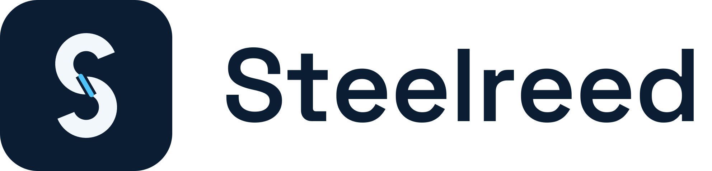

  <picture>
    <source media="(prefers-color-scheme: dark)" srcset="steelreed-lockup-dark.svg">
    
  </picture>

<b>Backend tools that bend, not break.</b>

<a href="https://steelreed.com">steelreed.com</a>

In Aesop's fable, the storm uproots the oak, and the reed survives because it bends. In Vietnam,
where we build, the same lesson grows as bamboo.

Steelreed makes open-source tools for the parts of a backend that have to survive a storm: the
queries, the data and the infrastructure behind them. A growing share of that code is now written by
AI agents, so our tools check what actually runs, not what the code looks like.

## Projects

| Project | What it does | Status |
|---|---|---|
| [QueryFence](https://steelreed.com/queryfence/) ([GitHub](https://github.com/steelreed/queryfence)) | SQL policy testing for the JVM. Catches tenant leaks, unbounded updates and unsafe queries in your integration tests. | 0.1.0 in preparation |

## How we build

- **Fail closed.** When a tool cannot prove something is safe, it says so.
- **Measure ourselves.** We run our tools against realistic applications and publish the false-positive rate, not only the wins.
- **Small, dated releases.** Every change lands in a changelog.
- **Open source first.** Apache-2.0 unless a repository says otherwise.

## Contact

- Website: [steelreed.com](https://steelreed.com)
- Security reports: read our [security policy](https://github.com/steelreed/.github/blob/main/SECURITY.md).
- Everything else: hello@steelreed.com
